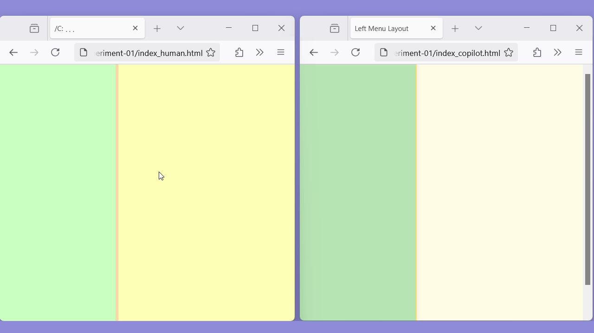

# 01_simple-HTML

Objective: A simple, one-page web app with a menu-like area on the left and a main area to the right. Someone viewing the web page can drag the menu wider or narrower.

<p>&nbsp;</p>


## HTML files

### Human mode
I have created web apps that had these elements before, so I had a bit of a head start:
- I already knew a little trick to do the mouse-drag-menu-resize functionality
- I could copy from an older project and refactor what I needed

HTML file: [index_human.html](index_human.html)

Time: < 1 hour

### LLM mode
I used GitHub Copilot chat in Visual Studio Code, with the default model, GPT-4.1.  See: [Getting started with Copilot in VS Code](https://code.visualstudio.com/docs/copilot/getting-started)

I ended up entering three inputs to the chat, accepting the generated code each time.

My chat inputs:
1. Make an html file with a narrow div on the left side, called "left_menu_div" and a main div, called "main_div".
2. Make the divs have a pleasant, spring color palette
3. Add Javascript so a user can drag the edge of the `left_menu_div` to make that div wider and the main_div narrower

Generated HTML file: [index_copilot.html](index_copilot.html)

Time: < 15 min

<p>&nbsp;</p>


## Testing
The HTML files were tested in Firefox.

Video: https://youtu.be/j0DES22nu9w



<p>&nbsp;</p>


## Analysis, remarks

### Things I had to look up
Even though I had done something like this before, I forgot a few things or had to look some things up:
- To choose a palette, I used this web page: https://coolors.co/palettes/trending
- I couldn't remember which cursor style to use, so I looked up the information here: https://www.w3schools.com/cssref/pr_class_cursor.php
- I copied the `resize_div` technique from an old project

### Ways the generated solution was better than the human one

1. **Page title**

   I didn't bother to add a title to the page, but the generated page had a title.  (A different sample will dive into this kind of issue and accessibility.)

2. **Dragging when the mouse leaves the page**

   To track the mouse as users drag the width of `left_menu_div`, I set an event listener for `mousemove` and `mouseup` on the `body` element:
   ```
   document.body.addEventListener( "mousemove", trackMouse );
   document.body.addEventListener( "mouseup", stopResizing );
   ```
   As a result, when the mouse left the page, dragging stopped and the width stopped changing.
  
   But the generated solution added those listeners onto the document:
   ```
   document.addEventListener( "mousemove", trackMouse );
   document.addEventListener( "mouseup", stopResizing );
   ```
   With this implementation, the dragging continued to work even when the mouse leaves the page, which was a nicer user experience.

### Problems with the generated solution

1. **Body overflow**

   In the generated solution, there is an unnecessary scroll bar on the body for some reason.

2. **Menu div doesn't go all the way to the bottom**

   When you scroll that scroll bar down, you can see the `left_menu_div` has no pants! (It's cut off.)

### Differences in the generated solution that could be problems

1. **Drag implementation**

   The generated solution used the same basic technique to achieve dragging the width: using a dragging div, tracking the mouse movements, and then adjusting the width of the 'left_menu_div`.  One minor difference is that the resizing div, `left_menu_resizer`, is insize `left_menu_div`.  A significant difference is that the generated solution sets the width of the `left_menu_div` to the mouse `clientX` value.  The human solution tracked the difference in the mouse `pageX` value and *applies that difference* to the menu width.  The generated solution is just fine for what was asked.  The difference-tracking approach is more general, working for multiple drag use cases.  If the project is extended to allow users to zoom in/zoom out, or if there are nested divs, the more general, human solution scales better.  But, again, for what was asked, the generated solution is fine.

3. **Min and max menu div width**
   
   For some reason, in the generated solution, there is a minimum and maximum width set for the `left_menu_div`.  I didn't ask for that in my prompts.  Some might consider this a feature that's obviously needed.  But it's a significant user experience element that I didn't ask for, so I'm considering it a form of hallucination.

2. **Unneeded, extra code**
   
   In the style area, there are style details that add no value and that are sometimes bizarre. In the HTML, there area unnecessary comments.  And in the Javascript, there are lines of unnecessary code.  Some might argue it doesn't matter.  But those extra pieces make merges just a bit more complex, they need to be maintained, and that must be understood by someone joining the project.

3. **Formatting**

   Coding style is something that some people will fight to the death about.  Like anyone, I have my preferences; but I don't know that there is one, best way.  However, the coding style within a project must be consistent.  If indenting is different here and there, or if brackets are lined up differently sometimes, or if there's inconsistency in the naming conventions of variables (for me: snake case) and functions (for me: camel case) all of these differences are potential sources of mistakes later, when maintaining the code.  If we can't reliably get LLMs to adhere to a specified coding style, merging the generated code into real projects is a recipe for disaster.


