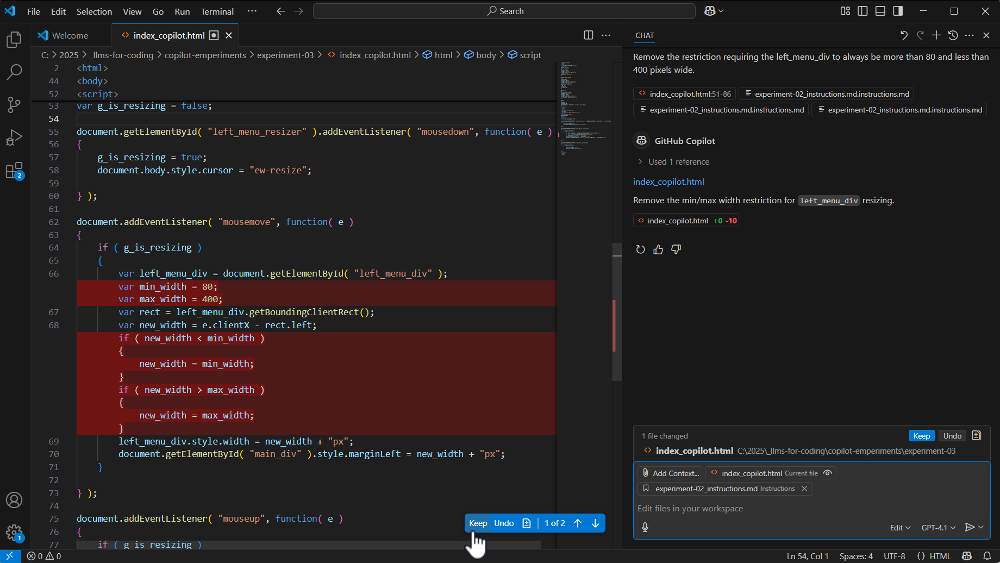
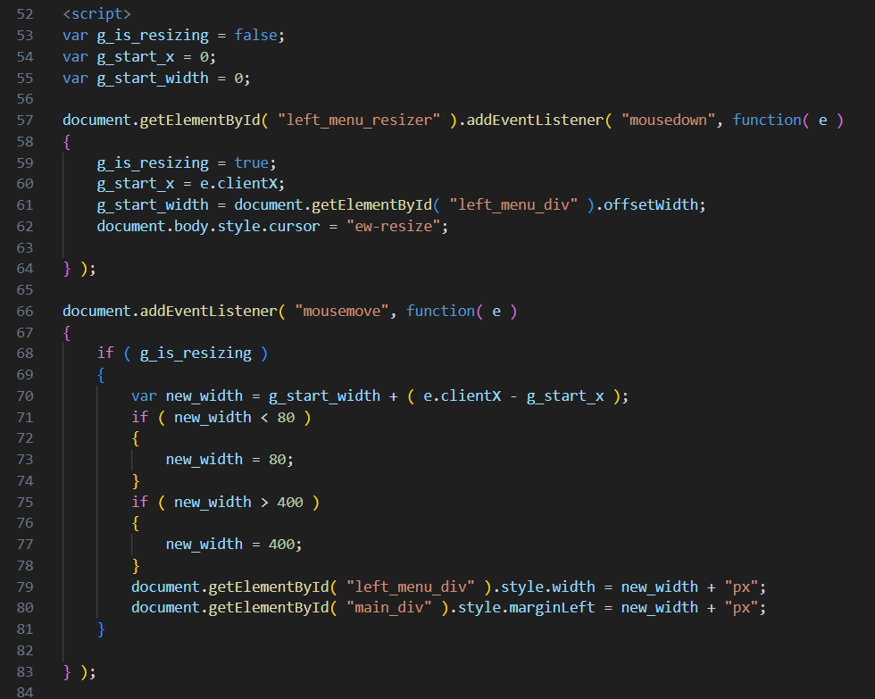
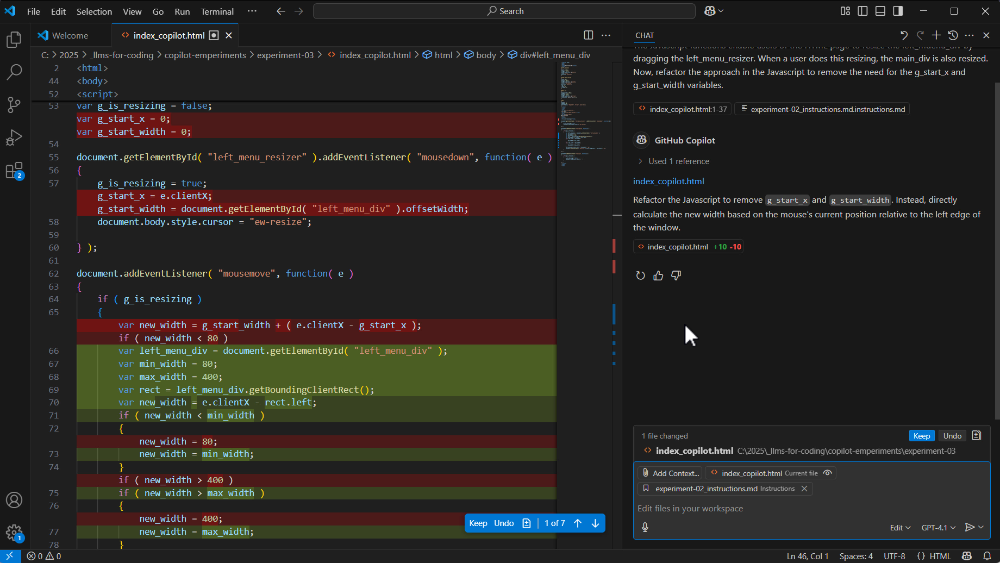
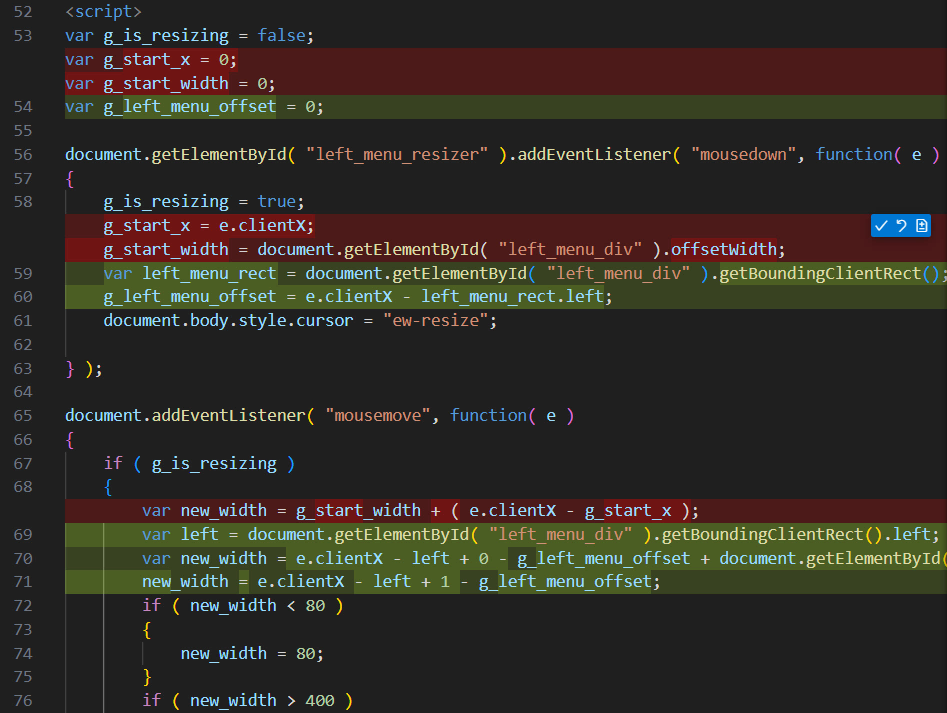
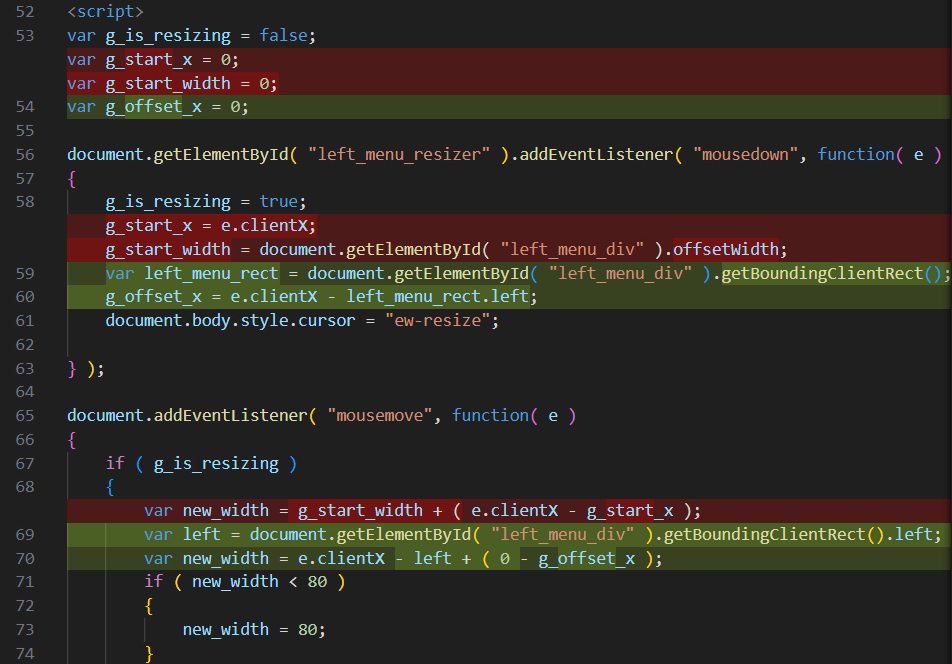
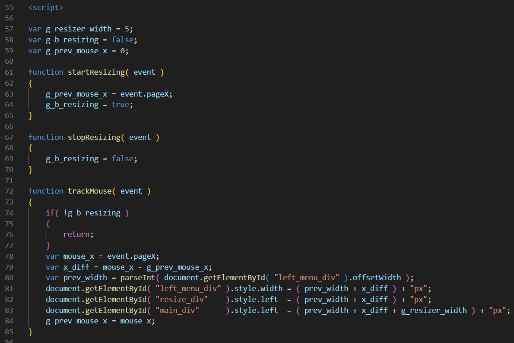

# 03_refactor

Objective: Refactor the AI-generated file from [02_simple-HTML-with-coding-style](../02_simple-HTML-with-coding-style):
- Remove unwanted text
- Refactor the convoluted resize Javascript
- Fix the resize delay artifact
- Get rid of the scroll bar

&nbsp;

## Refactored HTML file

I used GitHub Copilot chat in "Edit" mode in Visual Studio Code, with the default model, GPT-4.1.

See: [Copilot edits](https://code.visualstudio.com/docs/copilot/chat/copilot-edits)

My chat inputs:
1. The Javascript functions enable users of the HTML page to resize the left_mdenu_div by dragging the left_menu_resizer. When a user does this resizing, the main_div is also resized. Now, refactor the approach in the Javascript to remove the need for the g_start_x and g_start_width variables.
2. Remove the restriction requiring the left_menu_div to always be more than 80 and less than 400 pixels wide.
3. There should be no text visible to people viewing the web page. But do not add useless comments.
4. The dragging in the Javascript event handler for mousemove is too slow. When I resize, there is a delay before main_div is where it should be. Use a different implementation that is more efficient. [Didn't accept the generated output from this]
5. There should not be a scroll bar on the right side.

Generated HTML file: [index_copilot.html](index_copilot.html)

Time: > 1 hour (after that I gave up on the AI!)

&nbsp;

## Testing
The HTML file was tested in Firefox.

Video: https://youtu.be/OshXjT26v8I

&nbsp;

## Analysis, remarks

### The refactoring sometimes made things worse instead of better
Here's what the AI generated for sample 02: 

Here are three examples of the AI trying to simpilfy the `mousemove` event handling:

</td>

For comparison, here's the human-written version: 

There are many perfectly fine ways to implement this simple web page.  When I generated the source from scratch multiple times, the different solutions weren't all terrible.  But there seems to be something extra difficult for the LLM in the refactoring use case.  When I submitted the same refactoring prompt to the same starting file multiple times, the different refactoring attempts were often not great.  When I experimented with different prompt text, it sometimes worked better... But at a certain point, it was like playing the "warmer - colder" game with the AI, trying to nudge it towards what I know will be better approaches.  At that point, why use AI??  It would have been much more efficient to just fix the code by hand.

### I wish I could more easily revert back to earlier states
As I was trying to get the AI to do better, I kept reloading the original HTML file and restarting the chat... And forgetting to save the logs.  The user experience of experimenting with different prompts needs better design in the OpenAI API, the GitHub Copilot tooling, and in Visual Studio Code.

