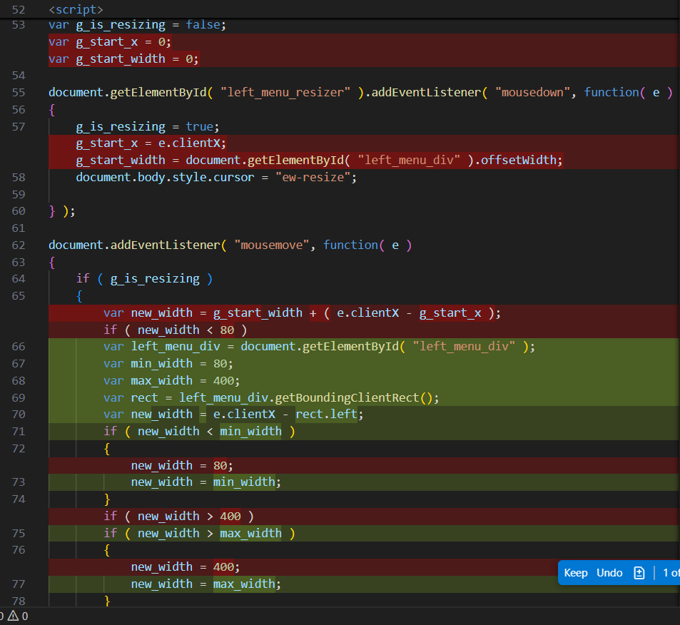

# 03_refactor

Objective: A simple, one-page web app with a menu-like area on the left and a main area to the right. Someone viewing the web page can drag the menu wider or narrower.

Refactor the AI-generated file from [02_simple-HTML-with-coding-style](../02_simple-HTML-with-coding-style):
- Remove the unwanted text
- Refactor the convoluted resize Javascript
- Get rid of the scroll bar

&nbsp;

## Refactored HTML file

I used GitHub Copilot "Edit" chat in Visual Studio Code, with the default model, GPT-4.1.

See: [Copilot edits](https://code.visualstudio.com/docs/copilot/chat/copilot-edits)

My chat inputs:
1. 

Generated HTML file: [index_copilot.html](index_copilot.html)

Time: > 1 hour (after that I gave up on the AI!)

&nbsp;

## Testing
The HTML file was tested in Firefox.

Video: https://youtu.be/676irOQUhSo

&nbsp;

## Analysis, remarks

### The refactoring sometimes made things worse instead of better

Here's what the AI generated for sample 02: 

Here are three examples of the AI trying to simpilfy the `mousemove` event handling:

</td>

For comparison, here's the human-written version: 

### I wish I could more easily navigate back to earlier states

