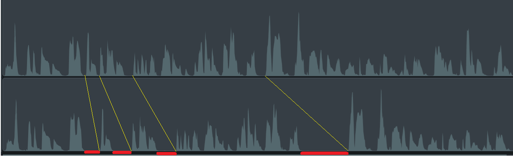

# 04_ffmpeg

Background: When I record how-to or "explainer" videos, there are often pauses as I assemble my words (even when I write out scripts ahead of time.)  I manually edit the video to remove the pauses so my sentences flow smoothly. 

### Example
Here's a snippet of the original recording of the demo video for the 01_simple-HTML experiment: 
https://youtu.be/VlWuwCacBb8

Here's what the audio track looks like in the editing tool, TechSmith Camtasia: 

Here's what the audio track looks like after I remove the pauses: 

This is where the silences were removed: 

But manually editing the video to trim out the silences is really tedious.  Let's use the [ffmpeg library](https://www.ffmpeg.org/ffmpeg.html) to edit out those silences.

Objective: Use ffmpeg to process video in different ways:
- Extract audio from video
- Identify silences in the audio
- Edit the video to trim out the silences

&nbsp;

## Extracting audio from .mp4 file

&nbsp;

## Identify silences

&nbsp;

## Trim silences

&nbsp;

