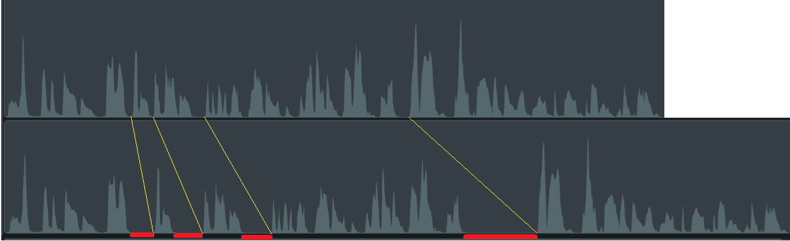

# 04_ffmpeg

## Background
When I record how-to or "explainer" videos, there are often pauses as I assemble my words (even when I write out scripts ahead of time.)  So, I manually edit the video to remove the pauses so my sentences flow smoothly. 

### Example
Here's a snippet of the original recording of the demo video for the 01_simple-HTML experiment:<br/>
https://youtu.be/VlWuwCacBb8 (Length: 32 seconds)

Here's what the audio track looks like in the editing tool, TechSmith Camtasia:<br/>


Here's that same video snippet with the pauses removed:<br/>
https://youtu.be/NWX_KS105sA (Length: 23 seconds)

Here's what the audio track looks like with the pauses removed:<br/>


The following image shows where the silences were removed:<br/>


## Pain point
Manually editing the video to trim out the silences is really tedious.

## Objective
Use the [ffmpeg library](https://www.ffmpeg.org/ffmpeg.html) to process video in different ways:
- Extract audio from video
- Identify silences in the audio
- Edit the video to trim out the silences

The ffmpeg library is a popular library for working with video and audio.  But it can be difficult to learn and confusing to use even with experience.  Can AI  use this library correctly??

<p>&nbsp;</p>


## Extracting audio from .mp4 file
Extracting audio from a video is a very common task and not too tricky, so that's a good place to start.

Here's the human-written version:<br/>
[extract-audio_human.js](extract-audio_human.js)

Here's a video stepping through generating code to do the same thing:<br/>
https://youtu.be/4aeILWoy07E

### Detailed prompt
At first, I assumed the AI would need a lot of hand-holding:
- Prompt 1:
   ```
   In this node.js file, create a method with the following properties:
    - The method is named extractAudio
    - The method takes one parameter, called "video_filename"
    - The method sets a local variable, called "audio_filename", with the same base name as video_filename, but with an .mp3 extension
    - A local variable, called "cmd", is the system command to call the ffmpeg library to extract audio from the file named by video_filename and save that audio in the file named by audio_filename
    - The method uses console.log to print the cmd and the ffmpeg output
     ```
- Prompt 2:
   ```
   create a global variable, called "g_video_filename", set to the value: "sample-video.mp4"
   ```
- Prompt 3:
   ```
   Call extractAudio, passing g_video_filename as the parameter
   ```

Running the generated file failed because `ffmpeg.exe` isn't in the `PATH` environment variable (which I knew ahead of time.)  So I asked the AI to help troubleshoot the problem with this prompt:
```
When I run this program, I get the error: "'ffmpeg' is not recognized as an internal or external command"
```

The generated response was this:
```
No code changes are needed. The error message indicates that `ffmpeg` is not installed or not in your system's PATH.
To fix this:
1. Install ffmpeg from https://ffmpeg.org/download.html.
2. Add the ffmpeg executable directory to your system's PATH environment variable.
3. Restart your terminal or command prompt.\n\nAfter these steps, rerun your program.
```

That suggestion isn't totally wrong.  But installing `ffmpeg` can sometimes be a challenge.  Trying to follow those instrucations could send you down a frustrating rabbit hole that sucks up a lot of time with no successful outcome.

I like to use the [Node.js package manager (NPM)](https://www.npmjs.com) to install ffmpeg and the handy component [`@ffmpeg-installer/ffmpeg`](https://www.npmjs.com/package/@ffmpeg-installer/ffmpeg) to handle the path at run time.  So I prompted the AI to also do that with this prompt:
```
use @ffmpeg-installer/ffmpeg to get the path to ffmpeg at run time
```

Here's the file that was generated:</br>
[extract-audio_copilot_full-instructions.js](extract-audio_copilot_full-instructions.js)

Running that generated file successfully extracted the audio from the video into an .mp3 file.  Hooray!

### Short, high-level prompt
I wondered if the AI would think to use `ffmpeg` if I hadn't been so fussy with my prompt.  So I tried a very high-level prompt:
```
Create a node.js script that extracts audio from an .mp4 file
```

The generated file was surprisingly similar to what was generated from the previous, fussy prompting.  I used the same `@ffmpeg-installer/ffmpeg` as before to handle the path, and then tried running the generated file.

When I ran the generated file, there was a problem: 

Here's the file that was generated:</br>
[extract-audio_copilot_less-instructions.js](extract-audio_copilot_less-instructions.js)

<p>&nbsp;</p>


## Identify silences
Before trimming pauses or silences out of a video, you first need to identify them.

Here's the human-created solution:<br/>
[detect-silence_human.js](detect-silence_human.js)

Here's a video stepping through generating code to do the same thing:<br/>
https://youtu.be/Yl6YRygJanM

Based on the experience with the extract-audio sample, when I prompted the AI to generate a solution, I gave this high-level prompt:
```
Create a node.js program to detect the periods of silence in a given .mp4 video file.
Print the silences out in an array of JSON structures like this:
[ { \"silence_start\" : <start-time>, \"silence_end\" : <end-time> }, ... ]
```

Then I used the same prompt as before to get the `ffmpeg` path.

When I ran the generated script, there was a problem: No silences were detected!  (For a decription of what was wrong, watch the video above or see [Root cause of the problem](#root-cause-of-the-problem) below.)

So I use this prompt to get the AI to fix the problem:<br/>
```
This implementation didn't find all the silences
```

The regenerated code did successfully find the silences.  (But the solution sure wasn't intuitive.)

Here's the file that was generated:</br>
[detect-silence_copilot.js](detect-silence_copilot.js)

### Root cause of the problem
The reason no silences were captured is because the `parseFfmpegOutput` routine was expecting to receive the entire output from the `ffmpeg` call at once:
```
function parseFfmpegOutput( data )
{
    var lines = data.toString().split( "\n" );
    var silence_start = null;

    for( var i = 0; i < lines.length; i++ )
    {
```
But the `detectSilence` routine was calling `parseFfmpegOutput` every time a bit of data was returned from the `ffmpeg` call:
```
var ffmpeg = spawn( ffmpegPath, ffmpeg_args );

    ffmpeg.stderr.on( "data", function( data )
    {
        console.log( "data\n" + data ); // <-- I added this to debug the problem
        parseFfmpegOutput( data );

    } );
```
When I added that debugging line, this is what I saw:
```
.
.
.
data
[silencedetect @ 0000024232e6d400] silence_start: 20.0005

data
[silencedetect @ 0000024232e6d400] silence_end: 20.7635 | silence_duration: 0.763016

data
[silencedetect @ 0000024232e6d400] silence_start: 21.5215
[silencedetect @ 0000024232e6d400] silence_end: 22.1046 | silence_duration: 0.583107

data
[silencedetect @ 0000024232e6d400] silence_start: 23.9035
.
.
.
```

<p>&nbsp;</p>

### Error handling
When you specify an output file that already exists, the default `ffmpeg` behavior is to print the following message and wait for user input:
```
File 'sample-video.mp3' already exists. Overwrite ? [y/N]
```

My human-written script just fails in this case.  That's not great, but the AI-generated solution is worse: it just hangs!

<p>&nbsp;</p>


## Trim silences
The big finale.

Here's the human-created solution:<br/>
[trim-silence_human.js](trim-silence_human.js)

Here's a video stepping through generating code to do the same thing:<br/>
_working..._

Initial prompt:
```
Create a node.js script that trims silent parts from an .mp4 file
```

Then I used the same prompt as before to get the `ffmpeg` path.


<p>&nbsp;</p>


## Analysis, remarks

### UX-breaking extension update
The way files are included as context was changed in a recent update to the GitHub Copilot VS Code extension:<br/>
https://youtu.be/JQRytAkPh7g

In a nutshell: VC Code creates a new file every time you submit a prompt, unless you click the name of the file you already have open in the editor.

### Confusion about content pulled into prompts as context
There are other fishy things about how files are included as context too:
- For example, sometimes it looks like the same instruction file is being pulled in multiple times.
- Also, I started to wonder if VS Code was reading the contents of the directory in which my current file is located and then including the contents of those other files in the directory as context too.  The thing that made me wonder this is that I was seeing spooky similarities between generated code and what's in other files in the working directory (I have no proof of this.)  This cunfusion and lack-of-trust is a result of the lack of transparency and obfuscation around what VS Code does, what Copilot does, and what OpenAI does between the prompt text you write and the LLM that is generating output.

### Human factors: I'm not checking the code like I should be
For some of the messier implementations, as I was prompting the AI to fix bugs, I stopped even trying to understand what the generated was doing.  I found myself not even reading the code.  I just ran the solution and then prompted the AI with "Running this script returned this error: <error-message>".  That's not the way to work on customer-facing, production code!  But when I forced my eyeballs to scan the offending, messy, bizarre code, my brain was screaming in agony.  It sounds extreme even to me.  And this is just one, small file.  I cannot stress strongly enough how unlikely it is that developers will thoroughly review AI-generated code like they should.  This means "have a review process in place" is not a good way to mitigate the risk of AI-generated code having serious security, privacy, accessibility, and performance problems.

<p>&nbsp;</p>

