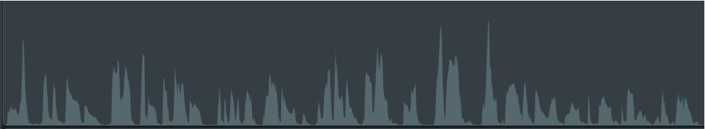

# 04_ffmpeg

## Background
When I record how-to or "explainer" videos, there are often pauses as I assemble my words (even when I write out scripts ahead of time.)  So, I manually edit the video to remove the pauses so my sentences flow smoothly. 

### Example
Here's a snippet of the original recording of the demo video for the 01_simple-HTML experiment: 
https://youtu.be/VlWuwCacBb8 (Length: 32 seconds)

Here's what the audio track looks like in the editing tool, TechSmith Camtasia: 

Here's that same video snippet with the pauses removed: 
https://youtu.be/NWX_KS105sA (Length: 23 seconds)

Here's what the audio track looks like with the pauses removed: 

The following image shows where the silences were removed: 

## Pain point
Manually editing the video to trim out the silences is really tedious.

## Objective
Use the [ffmpeg library](https://www.ffmpeg.org/ffmpeg.html) to process video in different ways:
- Extract audio from video
- Identify silences in the audio
- Edit the video to trim out the silences

&nbsp;

## Extracting audio from .mp4 file

&nbsp;

## Identify silences

&nbsp;

## Trim silences

&nbsp;

## Analysis, remarks

### UX-breaking extension update
The way files are included as context was changed in a recent update to the GitHub Copilot VS Code extension: 
https://youtu.be/JQRytAkPh7g

In a nutshell: VC Code creates a new file every time you submit a prompt, unless you click the name of the file you alread have open in the editor.

