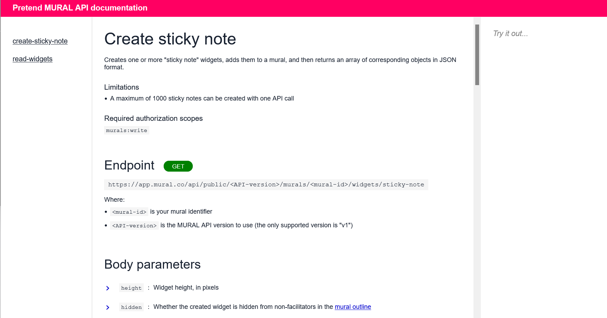
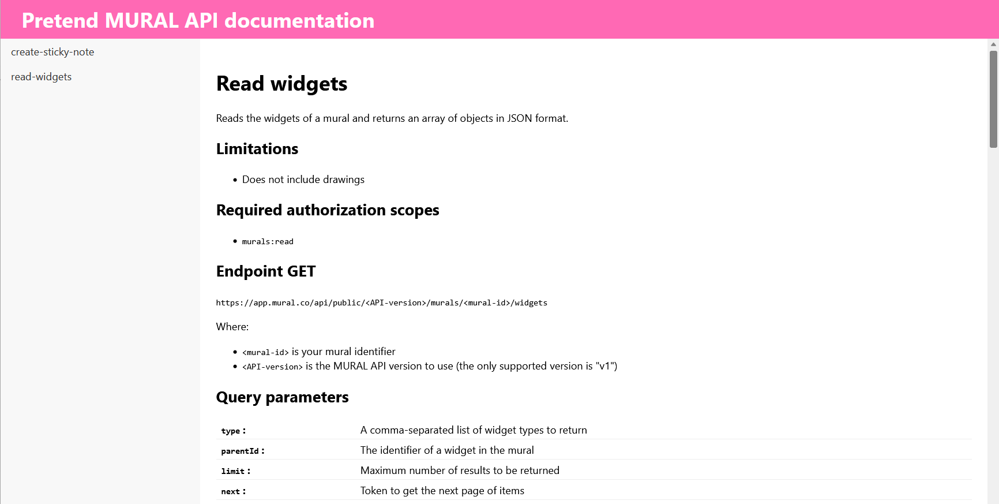

# 06_docs-app
Objective: Create a node.js web app to display API documentation.

Specifically, will make a little doc app to document two endpoints in the MURAL API:
- https://developers.mural.co/public/reference/getmuralwidgets
- https://developers.mural.co/public/reference/createstickynote

\*This experiment focusses on Copilot's ability to create/edit multiple files in a directory.

Here's a video discussing the experiment and results: https://youtu.be/yJF42LqN0pA

&nbsp;

## Human solution
Here's the human-written code: [human-solution](human-solution)

&nbsp;

## Generated solution
Here's the solution generated by Copilot: [copilot-solution](copilot-solution)

Here are the prompts I submitted: [prompts.html](prompts.html) 
(I formatted this in html so you could read it more easily in a browser.)

&nbsp;

## Analysis, remarks

### Initial results seem promising
Once again, the initial results were better than expected.  I am still entertained when I see code, and entire files, being created that is very compelling at first glance.  Even though I'm about to complain that the generated code isn't good enough to use in production, the technology is still quite amazing to see.

### Bugs
Particularly when refactoring - moving a piece of code from one place to another - Copilot generated code that was syntactically invalid.

### Not robust
The code Copilot generated was not very defensive.  For example, accessing fields without making sure those fields exist.

### Poor error handling
The lack of robustness would not necessarily be a problem if there was robust error handling.  There was some try/catch handling.  But not enough overall.

### Tedious and not time-saving
It didn't feel like I was describing my goal for the web app, and then Copilot was building it intelligently.

Instead, it felt like I was dictating how to reproduce my hand-made solution, which was painfully tedious to explain.

Trying to explain how I wanted the interaction in the interface - the collapsable text - was impossible.  (And I was cheating anyway there, because the HTML being pulled in was hand-written, with classes set up to enable the css I knew I wanted.)

&nbsp;

