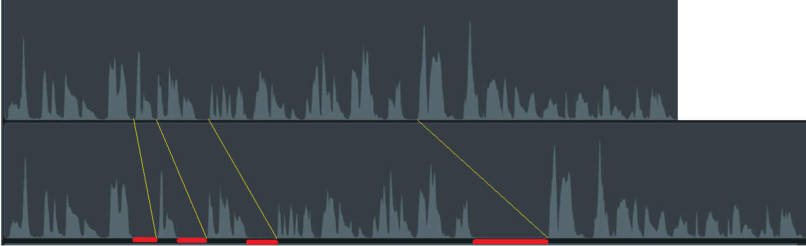
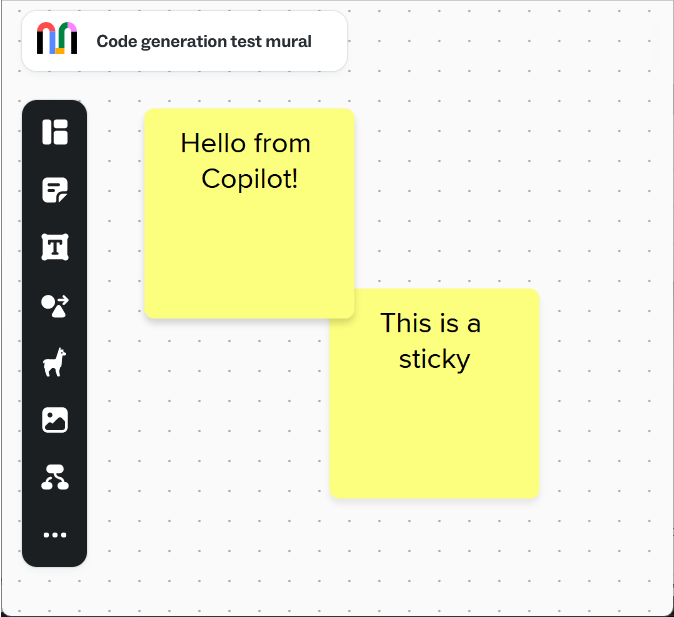

# Code generation exploration
A dive into using large language models (LLMs) to generate code.

Using little projects to explore issues:
- How much time is saved by using LLMs?
- What mistakes do LLMs make?
- What type of work do LLMs do well?

&nbsp;

## Projects
<table>
<tr>
<th>Project</th>
<th>AI tools</th>
<th>Notes</th>
</tr>
<tr><!-- 01_simple-HTML -->
<td valign="top">

<a href="01_simple-HTML/README.md">01_simple-HTML</a>

</td>
<td valign="top">

<b>GitHub Copilot</b>

<ul>
<li>In&nbsp;Visual&nbsp;Studio&nbsp;Code</li>
<li>Chat "Ask" mode</li>
<li>Default model, GPT-4.1</li>
<li>See: <a href="https://code.visualstudio.com/docs/copilot/getting-started">Getting started with Copilot in VS Code</a></li>
</ul>
</td>
<td valign="top">

A simple web page with a menu-like area on the left and a main area to the right. 
Users can drag the menu wider or narrower.

<ul>
<li>There's a bit of a trick to the menu resize functionality</li>
<li>UX style choices include colors and mouse pointer</li>
<li>Coding style choices include formating, naming conventions</li>
<li>Architectural choices include HTML elements, how to break up JavaScript functionality</li>
</ul>
</td>
</tr>
<tr><!-- 02_simple-HTML-with-coding-style -->
<td valign="top">

<a href="02_simple-HTML-with-coding-style/README.md">02_simple-HTML-with-coding-style</a>

</td>
<td valign="top">

Same as above

</td>
<td valign="top">

Same, simple web page as <code>01_simple-HTML</code>.  Same three prompts.

But this time, coding style is specified in an <code>instructions.md</code> file. See: <a href="https://code.visualstudio.com/docs/copilot/reference/copilot-vscode-features#_customize-ai-code-generation">Customize AI code generation</a>

The HTML page content and user experience need to be correct, as before. <b>AND</b> the coding style of the CSS, HTML, and Javascript must conform to the instructions.

</td>
</tr>
<tr><!-- 03_refactor -->
<td valign="top">

<a href="03_refactor/README.md">03_refactor</a>

</td>
<td valign="top">

Same as above, but using chat "edit" mode

</td>
<td valign="top">

Refactoring the HTML file generated in <code>02</code>:

<ul>
<li>Remove the unwanted text</li>
<li>Remove the unwanted scroll bar</li>
<li>Remove the unwanted min and max width restriction</li>
<li>Fix the drag delay (or try to)</li>
</ul>
</td>
</tr>
<tr><!-- 04_ffmpeg -->
<td valign="top">

<a href="04_ffmpeg/README.md">04_ffmpeg</a>

</td>
<td valign="top">

Same as above

</td>
<td valign="top">

Generating scripts that use the <a href="https://www.ffmpeg.org/ffmpeg.html"><code>ffmpeg</code> library</a>:

<ul>
<li>Extract audio from an .mp4 file</li>
<li>Identify silences in a video</li>
<li>Trim silences from a video</li>
</ul>
</td>
</tr>
<tr><!-- 05_MURAL-API -->
<td valign="top">

<a href="05_MURAL-API/README.md">05_MURAL-API</a>

</td>
<td valign="top">

Same as above, with the <a href="https://code.visualstudio.com/docs/copilot/chat/copilot-chat-context#_reference-web-content">#fetch feature</a>

</td>
<td valign="top">

Generating scripts that use the <a href="https://developers.mural.co/public/reference/intro">MURAL API</a>:

<ul>
<li>Read widgets from a mural</li>
<li>Add a sticky note to a mural</li>
</ul>
</td>
</tr>
</table>

&nbsp;

## Comments
**Quality problems** 
There are many perfectly fine ways to implement the simple examples shown here.  However, the AI-generated code often contained vague parameter or function names, unneeded lines of code, and unintuitive implementation.  Troubleshooting, debugging, maintaining, and adding new features are all made more complex by those problems.  Maybe 10% - 30% of the code has these problems.  For projects this small, that's not such a big deal.  But for a project with hundreds of files and hundreds of thousands of lines of code, that amount of those problems makes maintaining the solution extremely challenging.  

**Maintenance** 
In my experience, dropping the initial version of a software solution is easy compared to maintaining it over subsequent years - whether it's new team members who have to reverse engineer the solution to understand the code base, or it's yourself and you just can't remember what you were thinking when you wrote the code.  In these experiment, blocks of code generated by AI had problems that would make maintenance very challenging.  And the AI-refactoring capability I saw in these experiments is very limited in usefulness.

&nbsp;

